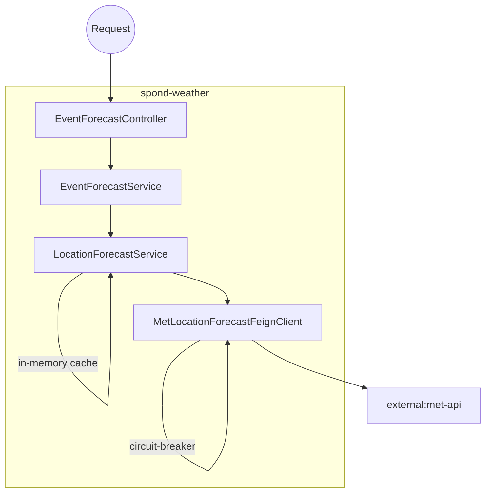

# spond-weather
take home test for spond backend eng position

---

# Running Locally 

```shell
$ export JAVA_HOME=/path/to/jdk-25              # set JAVA_HOME to point to JDK-25
$ ./mvnw clean install                          # build and run tests
$ ./mvnw spring-boot:run                        # run the app
```
Access the endpoints on swagger with [[spond-weather-api]](http://localhost:8080/swagger-ui/index.html)

---

# High-Level Design



- EventForecastController: Validate and round the latitude/longitude to 2-decimals(~1 sq.km) before forwarding requests to ForecastService 
- EventForecastService: Call LocationForecastService to get forecast for latitude/longitude, match the event timestamps and return arithmetic mean of air-temp & wind-speeds
- LocationForecastService: Check for cache-hits based on rounded latitude & longitude, else make API call with feign-client
- MetLocationForecastFeignClient: If the circuit-breaker is `OPEN`, call fallback method, else make an API call to `met.no`
 
---

# Improvements & Next Steps

- If we have something like `EventService` & `UserService` we can get events by eventIds/userIds instead
- If there's a `GeolocationService` to map lat/lon into postal codes, we can improve cacheability by caching on postal codes instead of rounded lat/lon
- Use distributed cache like Redis instead of Caffeine
- Test coverage could be greatly improved
- Handle conversions for Imperial units instead of hard-coded `m/s` wind_speed & `celsius` air_temp units 
- Depending on product requirements, replace simple rounding up of latitude & longitude approximation with standard GIS libraries like ApacheSIS/Proj4j for much higher accuracy

---

# AI Usage

- No AI usage for the design, planning, implementation & testing of the project
- Gemini to know more about latitude and longitude, specifically to improve my cacheability ideas